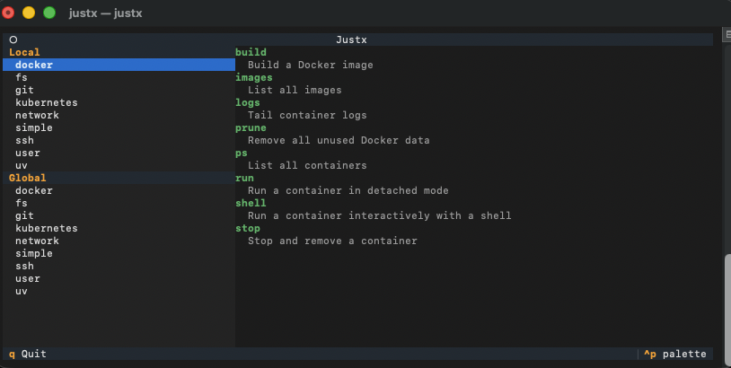

<p align="center">
  
</p>

---

[](https://img.shields.io/github/v/release/fpgmaas/justx)
[](https://github.com/fpgmaas/justx/actions/workflows/main.yml?query=branch%3Amain)
[](https://pypi.org/project/justx/)
[](https://codecov.io/gh/fpgmaas/justx)
[](https://pypistats.org/packages/justx)
[](https://img.shields.io/github/license/fpgmaas/justx)

**justx** is a A TUI command launcher built on top of [just](https://github.com/casey/just). Define recipes once, run them anywhere.

<p align="center">
  
</p>

---

<p align="center">
  <a href="https://fpgmaas.github.io/justx/">Documentation</a> &nbsp;·&nbsp;
  <a href="https://pypi.org/project/justx/">PyPI</a>
</p>

---

## Installation

```shell
uv tool install justx   # recommended
# or
pip install justx
```

> **Prerequisite:** the [`just`](https://github.com/casey/just#installation) binary must be available on `$PATH`.

## Quickstart

**1. Initialise your global recipe library:**

```shell
justx init
```

This creates `~/.justx/` with a sample justfile to get you started. To pull in a richer set of ready-made recipes (git, docker, filesystem tools, and more), run:

```shell
justx init --download-examples
```

**2. Launch the TUI:**

```shell
justx
```

Browse your recipes with the arrow keys and press `Enter` to run one. Press `q` to quit.

## Global recipes

**justx** supports global recipes; recipes that are available from anywhere on your machine, no matter which project you're in.

Split them into topic-focused files if you like:

```
~/.justx/
├── justfile        # everyday catch-all recipes
├── git.just        # git workflows
├── docker.just     # container management
└── ssh.just        # remote connections
```

For example, `~/.justx/docker.just` might contain:

```just
# Run a container interactively with a shell
shell image_tag:
    docker run --rm -it --entrypoint bash {{image_tag}}
```

**justx** discovers these automatically and makes them available everywhere on your system by running `justx` in your terminal.

You can also skip the TUI and run recipes directly with `justx run`:

```shell
# Run 'shell' from the global 'docker' group with `my-image` as the tag
# Equivalent to: just --justfile ~/.justx/docker.just --working-directory . shell my-image
justx run -g docker:shell my-image
```

---

For full configuration details, file discovery behaviour, CLI reference, and example justfiles, see the [documentation](https://fpgmaas.github.io/justx/).
